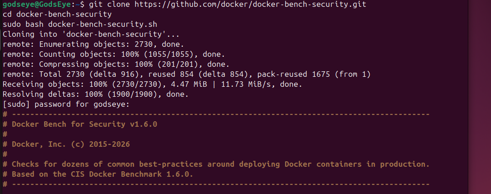
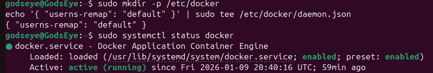
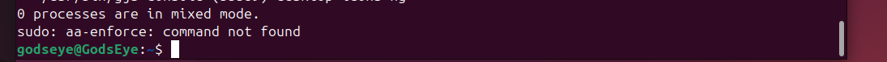
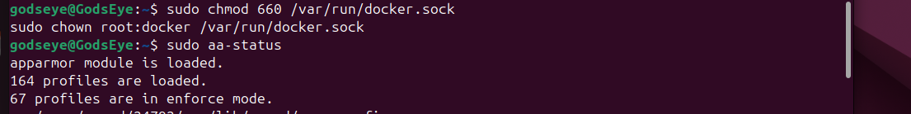
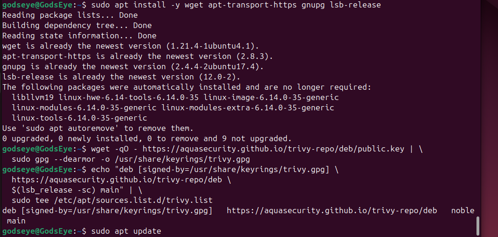
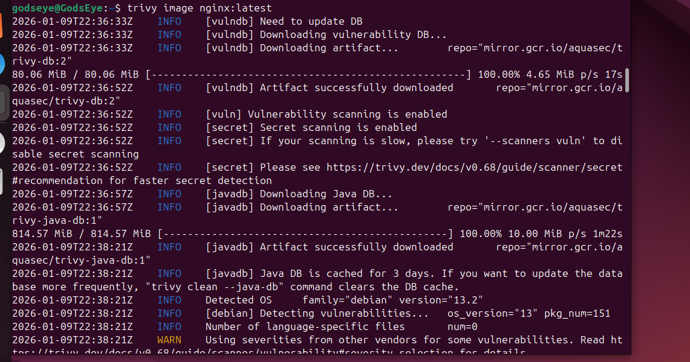
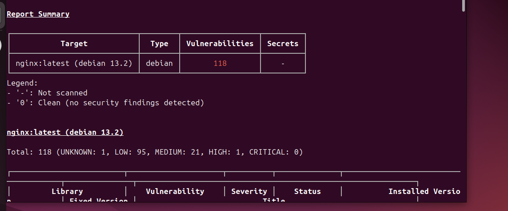

# Docker-Security-Configuration

# 🔐 Docker Security Hardening Steps (Ubuntu)

## **Step 1 — Install Docker Bench for Security**
**Purpose:** Automated CIS‑aligned security audit for Docker.

**Command:**
```bash
git clone https://github.com/docker/docker-bench-security.git
cd docker-bench-security
sudo bash docker-bench-security.sh
```


## **Step 2 — Enable and Configure UFW Firewall**
**Purpose:** Restrict inbound traffic and reduce attack surface.

**Command:**
```
sudo apt install ufw -y
sudo ufw default deny incoming
sudo ufw default allow outgoing
sudo ufw allow OpenSSH
sudo ufw enable
```

## **Step 3 — Disable Root Login for Docker Daemon**
**Purpose:** Prevent root‑level daemon exposure.

**Command:**
```
sudo mkdir -p /etc/docker
echo '{ "userns-remap": "default" }' | sudo tee /etc/docker/daemon.json
```


**Restart Docker:**
```
sudo systemctl restart docker
```

## **Step 4 — Enforce TLS for Docker Remote API (If Used)**
**Purpose:** Prevent MITM attacks and unauthorized access.

**Command** (generate certs):
```
mkdir -p ~/docker-certs
cd ~/docker-certs
openssl genrsa -aes256 -out ca-key.pem 4096
openssl req -new -x509 -days 365 -key ca-key.pem -sha256 -out ca.pem
```
(Add cert paths to /etc/docker/daemon.json if enabling remote API.)

## **Step 5 — Restrict Docker Socket Permissions**
**Purpose:** Prevent privilege escalation via /var/run/docker.sock.

**Command:**
```
sudo chmod 660 /var/run/docker.sock
sudo chown root:docker /var/run/docker.sock
```

## **Step 6 — Enable AppArmor for Docker Containers**
**Purpose:** Mandatory access control for container isolation.

**Command:**
```
sudo aa-status
sudo aa-enforce /etc/apparmor.d/docker
```



## **Step 7 — Enable Seccomp Profile**
**Purpose:** Limit syscalls available to containers.

**Command** (verify default profile):
```
docker info | grep -i seccomp
```
Run a container with seccomp explicitly:
```
docker run --security-opt seccomp=default.json hello-world
```

## **Step 8 — Use Rootless Docker Mode**
**Purpose:** Prevent containers from having root privileges on the host.

**Command:**
```
sudo apt install -y uidmap
dockerd-rootless-setuptool.sh install
```
Start rootless Docker:
```
systemctl --user start docker
```

## **Step 9 — Scan Images for Vulnerabilities (Trivy)**
**Purpose:** Identify CVEs in images before deployment.

**Install Trivy:**
```
sudo apt install -y wget apt-transport-https gnupg lsb-release

wget -qO - https://aquasecurity.github.io/trivy-repo/deb/public.key | \
  sudo gpg --dearmor -o /usr/share/keyrings/trivy.gpg

echo "deb [signed-by=/usr/share/keyrings/trivy.gpg] \
  https://aquasecurity.github.io/trivy-repo/deb \
  $(lsb_release -sc) main" | \
  sudo tee /etc/apt/sources.list.d/trivy.list

sudo apt update
sudo apt install -y trivy

```


**Scan an image:**
```
trivy image nginx:latest
```



## **Step 10 — Enforce Least Privilege Containers**
**Purpose:** Prevent containers from running with unnecessary privileges.

**Command examples:**
Drop all capabilities:
```
docker run --cap-drop=ALL nginx
```

Run read‑only filesystem:
```
docker run --read-only nginx
```

Disable privilege escalation:
```
docker run --security-opt no-new-privileges nginx
```

## **Step 11 — Audit Docker Daemon and Container Logs**
**Purpose:** Detect suspicious activity.

**Command:**
```
sudo journalctl -u docker --no-pager
sudo tail -f /var/log/syslog
```

## **Step 12 — Enable Automatic Security Updates**
**Purpose:** Keep host packages patched.

**Command:**
```
sudo apt install unattended-upgrades -y
sudo dpkg-reconfigure --priority=low unattended-upgrades
```

## **Step 13 — Verify Docker Daemon Configuration**
**Purpose:** Ensure hardened settings are applied.
**Command:**
```
docker info
cat /etc/docker/daemon.json
```

## **Step 14 — Reboot to Apply All Security Controls**
**Command:**
```
sudo reboot
```
